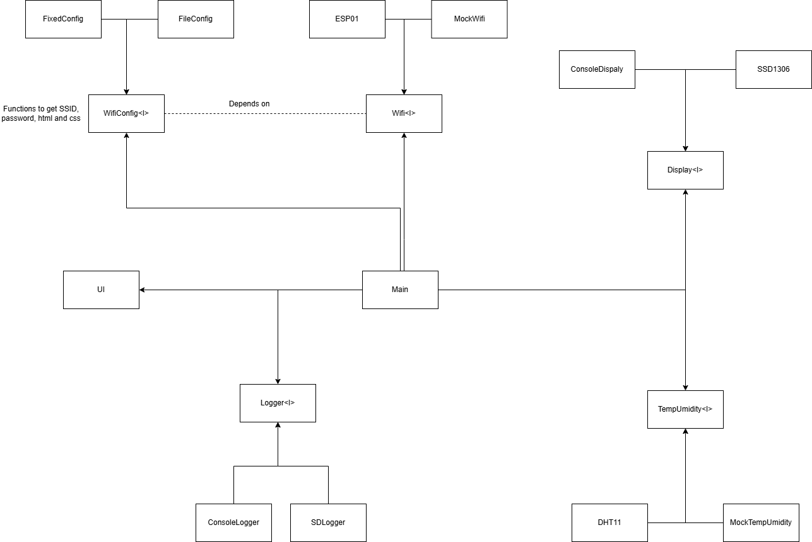
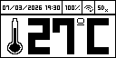
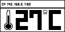
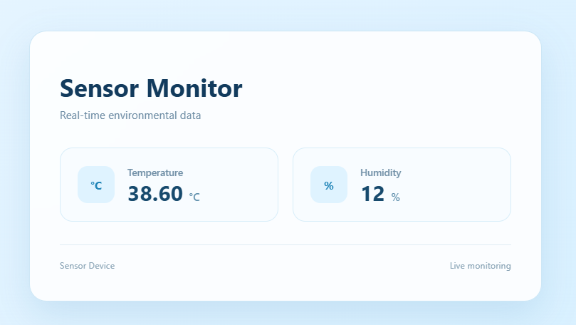
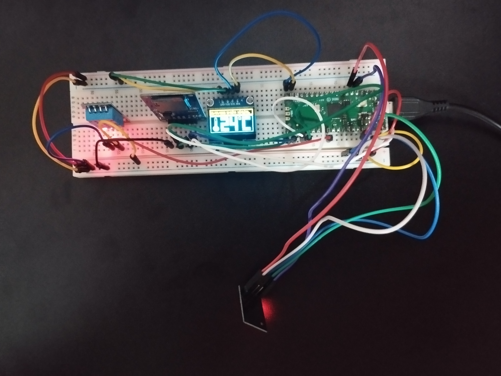
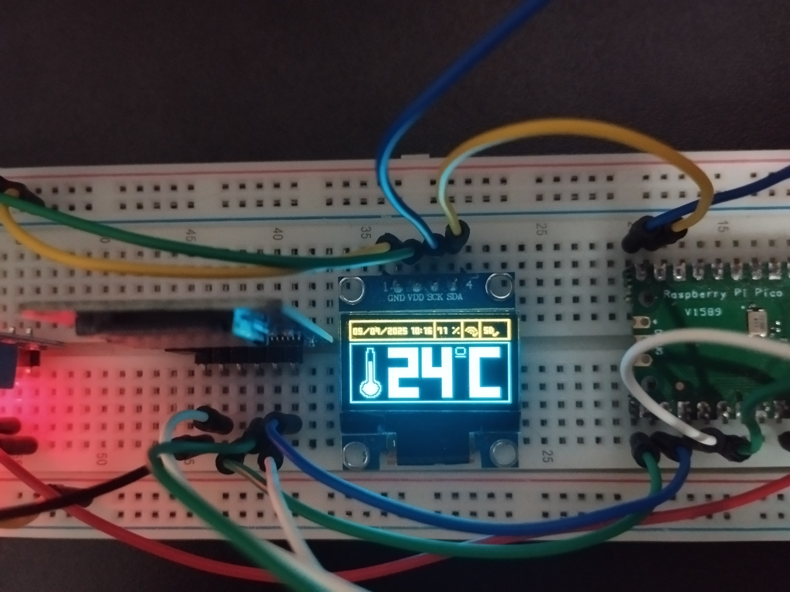

# Pico Environment Monitor
This project is an embedded application that uses an I2C OLED display, DHT11 temperature and humidity sensor, SD card module, and ESP-01 Wi-Fi module.

The main objective is to monitor environmental temperature and humidity. The data is read every 3 seconds and can be displayed either on the OLED screen or through a web page served by the Raspberry Pi Pico using the ESP-01 module for Wi-Fi connectivity.

In addition to displaying the current readings, the application logs the temperature and humidity data to a CSV file stored on the SD card every hour.

## Project structure
```
project
├─ CMakeLists.txt
├─ config.h.in
├─ fs_init.c
├─ generate_image_include
│  ├─ .env.example
│  ├─ generate_on_off_icons_array.py
│  ├─ generate_small_number_array.py
│  ├─ generate_temp_font_array.py
│  ├─ img_to_array.py
│  └─ requirements.txt
├─ images
│  ├─ class_diagram.png
│  ├─ OLED
│  │  ├─ full_screen.bmp
│  │  ├─ full_screen_network.bmp
│  │  ├─ on_off_icons.bmp
│  │  ├─ small_numbers_spritesheet.bmp
│  │  └─ temp_font_spritesheet.bmp
│  └─ pico_pinout.svg
├─ lib
│  ├─ consoleDisplay
│  │  ├─ include
│  │  │  └─ consoleDisplay.h
│  │  └─ src
│  │     └─ consoleDisplay.c
│  ├─ consoleLogger
│  │  ├─ include
│  │  │  └─ consoleLogger.h
│  │  └─ src
│  │     └─ consoleLogger.c
│  ├─ DHT11
│  │  ├─ include
│  │  │  └─ DHT11.h
│  │  └─ src
│  │     └─ DHT11.c
│  ├─ display
│  │  └─ display.h
│  ├─ Esp01
│  │  └─ src
│  │     └─ Esp01.c
│  ├─ logger
│  │  ├─ include
│  │  │  └─ logger.h
│  │  └─ src
│  │     └─ logger.c
│  ├─ MockTempHumidity
│  │  └─ src
│  │     └─ MockTempHumidity.c
│  ├─ MockWifi
│  │  ├─ include
│  │  └─ src
│  │     └─ MockWifi.c
│  ├─ pico-vfs
│  ├─ SDLogger
│  │  ├─ include
│  │  │  └─ SDLogger.h
│  │  └─ src
│  │     └─ SDLogger.c
│  ├─ ssd1306
│  │  ├─ include
│  │  │  └─ ssd1306.h
│  │  └─ src
│  │     └─ ssd1306.c
│  ├─ TempHumidity
│  │  ├─ include
│  │  │  └─ TempHumidity.h
│  │  └─ src
│  ├─ ui
│  │  ├─ include
│  │  │  ├─ full_screen.h
│  │  │  ├─ on_off_icons.h
│  │  │  ├─ small_numbers.h
│  │  │  ├─ temp_numbers.h
│  │  │  └─ ui.h
│  │  └─ src
│  │     └─ ui.c
│  ├─ Wifi
│  │  └─ include
│  │     └─ Wifi.h
│  ├─ WifiConfig
│  │  ├─ include
│  │  │  └─ WifiConfig.h
│  │  └─ src
│  ├─ WifiFileConfig
│  │  ├─ include
│  │  └─ src
│  │     └─ WifiFileConfig.c
│  └─ WifiFixedConfig
│     ├─ include
│     └─ src
│        └─ WifiFixedConfig.c
├─ main.c
├─ pico_sdk_import.cmake
├─ README.md
├─ sd-content
│  ├─ index.html
│  ├─ index.js
│  └─ style.css
└─ tests
   ├─ CMakeLists.txt
   └─ main_test.c
```

## Modules


* **Main:** The entry point of the application. It initializes all modules and coordinates their execution.

* **UI:** Stores and manages the UI elements and their current values, including temperature, humidity, Wi-Fi status, SD card status, and date and time.

* **Logger:** An abstract class that defines the logging interface and common functionality shared by concrete logger implementations.

* **ConsoleLogger:** A concrete implementation of `Logger` that outputs log information using `printf`. It is intended for testing purposes.

* **SDLogger:** A concrete implementation of `Logger` that stores log information in a CSV file on the SD card.

* **Display:** An interface that defines the display operations implemented by concrete display classes.

* **ConsoleDisplay:** A concrete implementation of `Display` that outputs UI information using `printf`.

* **SSD1306:** A concrete implementation of `Display` that renders UI information on the OLED screen using I2C commands.

* **WifiConfig:** An interface that defines the operations for retrieving Wi-Fi configuration information.

* **FixedConfig:** A concrete implementation of `WifiConfig` that provides a fixed Wi-Fi configuration.

* **FileConfig:** A concrete implementation of `WifiConfig` that retrieves Wi-Fi configuration information from a configuration file.

* **Wifi:** An interface that defines the operations required to initialize an HTTP server and handle client connections. The server serves files from the `sd-content` folder.

* **ESP01:** A concrete implementation of `Wifi` that uses AT commands to communicate with the ESP-01 and serve files from the `sd-content` folder.

* **MockWifi:** A concrete implementation of `Wifi` that uses Windows socket programming to simulate the web server and serve files from the `sd-content` folder.

* **TempHumidity:** An interface that defines the operations required to read environmental data.

* **DHT11:** A concrete implementation of `TempHumidity` that reads temperature and humidity data from the DHT11 sensor.

* **MockTempHumidity:** A concrete implementation of `TempHumidity` that provides simulated temperature and humidity readings, alternating between predefined values on each reading.

## Tests Instructions
The `tests/` folder contains a CMake project used to build the test program. The program runs a series of module tests to verify their expected behavior.

The build generates several static libraries used by the tests:

* `ui.lib`
* `consoleDisplay.lib`
* `WifiFixedConfig.lib`
* `MockWifi.lib`
* `consoleLogger.lib`
* `MockTempHumidity.lib`

To configure and build the test project, run:

```bash
cmake -S . -B build -G "Visual Studio 18 2026"
```

Then, run the test program with:

```bash
./build/Debug/test.exe
```


## Build Instructions
The project root folder contains a CMake project used to build the firmware for the Raspberry Pi Pico. It contains the main application code and integrates all the project modules.

The build generates several static libraries used by the application:

* `libui.a`
* `libssd1306.a`
* `libWifiFileConfig.a`
* `libEsp01.a`
* `libSDLogger.a`
* `libDHT11.a`

Before configuring the project, load the Pico SDK environment by running:

```powershell
C:\Users\<user>\PicoSDK\pico-env.ps1
```

Then, configure and build the project with:

```bash
cmake -S . -B build -G "Ninja"
```

After the build completes, upload the generated `main.uf2` file to the Raspberry Pi Pico.

## Images








